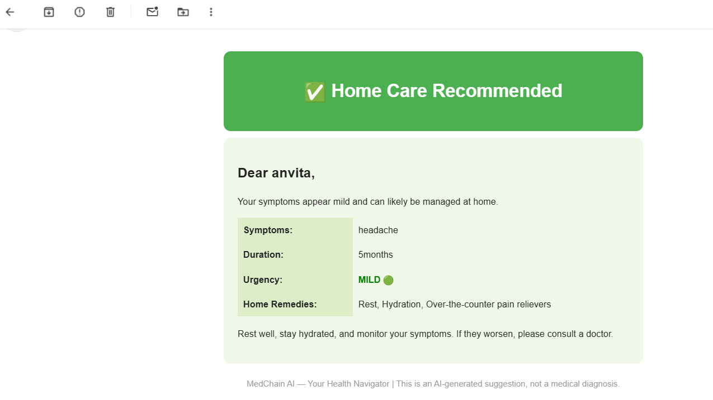

# 🏥 MedChain AI - n8n Workflow Automation

An AI-powered automation workflow built using n8n for smart email generation, healthcare process automation, and seamless API integrations.

---

## 🚀 Features
- 🤖 AI-powered email generation (LLM integration)
- 📧 Automated email workflows
- 🔗 API integrations (Groq / OpenAI)
- ⚡ Event-based automation
- 🧩 Scalable and customizable workflows

---

## 🛠️ Tech Stack
- n8n (Workflow Automation)
- Groq / OpenAI APIs
- JSON-based workflow
- Email services (SMTP/Gmail)

## 📸 Workflow Preview

## 🧩 Workflow Architecture

This workflow is designed using a modular AI-driven pipeline in n8n, enabling intelligent decision-making for healthcare-related queries.

### 🔄 Flow Overview

1. **Trigger**
   - `When chat message received`
   - Starts the workflow on user input

2. **AI Processing**
   - `AI Agent` processes the input
   - Uses:
     - Groq Chat Model (LLM)
     - Memory (context retention)

3. **Triage Classification**
   - `Triage Classifier` determines severity:
     - Emergency 🚨
     - Moderate ⚠️
     - Mild 🟢

4. **Decision Nodes**
   - Conditional checks:
     - `Is Emergency?`
     - `Is Moderate?`

5. **Action Layer**
   - Emergency:
     - Gmail Emergency Alert 📧
   - Moderate:
     - Doctor Finder 🌐 + Gmail Advice
   - Mild:
     - Gmail Mild Advice 📩

6. **Logging**
   - Google Sheets integration for tracking 🧾

---

## 📸 Workflow Diagram

---

## ⚙️ Key Components

| Component            | Purpose |
|---------------------|--------|
| AI Agent            | Handles user query with LLM |
| Groq Model          | Generates intelligent responses |
| Memory              | Maintains conversation context |
| Triage Classifier   | Classifies medical urgency |
| Gmail Nodes         | Sends automated emails |
| Google Sheets       | Logs workflow data |

---

## 🧠 System Design Highlights

- Modular workflow design  
- AI-driven decision making  
- Real-time classification system  
- Scalable automation pipeline  
- External API integrations  
---

## 🌟 Unique Features

- 🧠 **AI-based Medical Triage System**
  - Automatically classifies user queries into Emergency, Moderate, or Mild using LLM intelligence

- ⚡ **Real-time Decision Engine**
  - Dynamic branching using conditional nodes for instant action routing

- 📧 **Automated Multi-Level Response System**
  - Different email responses based on severity level

- 🌐 **Doctor Recommendation Integration**
  - Suggests relevant medical help for moderate cases

- 🧾 **Centralized Logging System**
  - Stores all interactions in Google Sheets for monitoring and analytics

- 🔄 **Context-Aware Memory**
  - Maintains conversation history for better AI responses

---
